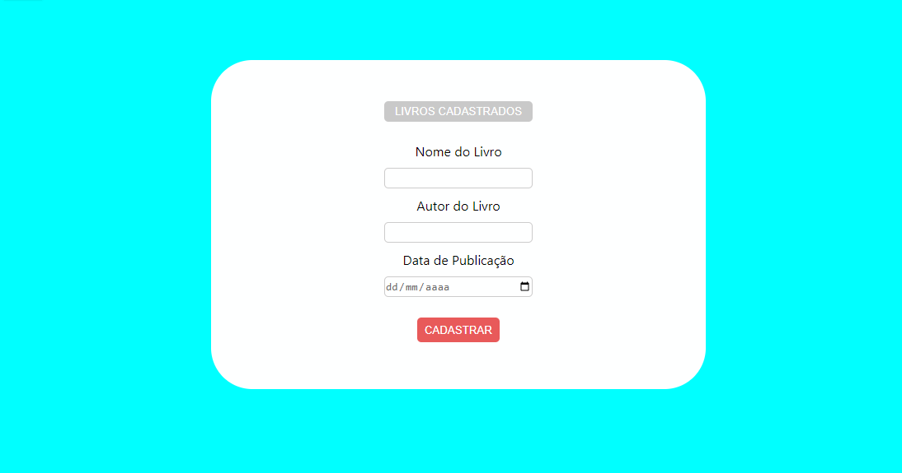
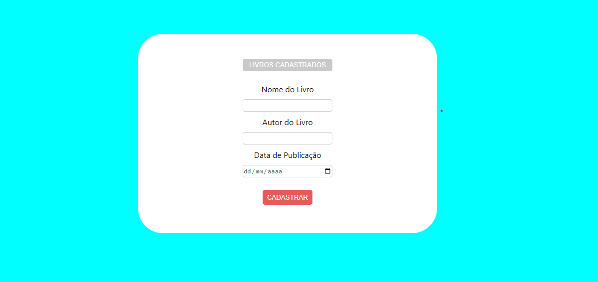
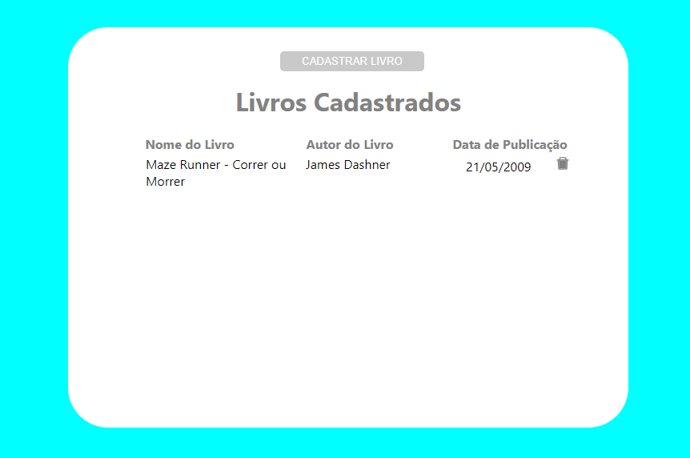

<h1 align="center">
Cadastro de Livros - Desafio
</h1>

## Índice

*[Sobre](#📕sobre-o-projeto)
*[Ferramentas usadas](#🔨ferramentas-usadas)
*[Frontend](#frontend)
*[Backend](#backend)
*[Rodando o Projeto](#rodando-o-projeto)
*[Contato](#contato)

## 📕Sobre o projeto
<p align = "Justify">O projeto é uma API para cadastros e remoção de livros.</p>



|  |  |  
|:---:| :---:| 


## 🔨Ferramentas usadas
- [JavaScript](https://developer.mozilla.org/en-US/docs/Web/JavaScript)
- [React JS](https://pt-br.reactjs.org/docs/getting-started.html)
- [MongoDB](https://www.mongodb.com/)
- [Node.JS](https://nodejs.org/en/)
- [Express](https://expressjs.com/pt-br/)

## Frontend

- tela 1

    Formulário para cadastro de livros
    
    Informações:
    
    O formulário terá os seguintes campos: Nome do Livro, Autor do livro, Data de publicação do livro.

- tela 2

    Uma Tabela para visualizar os Livros cadastrados.

## Backend

- API usando node.js e MongoDB. A API coleta os dados do formulário, cadastra no banco de dados MongoDB e depois traz esses dados para a Tabela (Tela 2).

## Rodando o Projeto

- Pré-requisitos

    - [Node.JS](https://nodejs.org/en/) e um gerenciador de pacotes "NPM ou Yarn" instalados na máquina.
    - Um API Client.
- Clonar o repositório

```bash
$ git clone https://github.com/talisonyago/Cadastro-de-Livros-Desafio.git
```
```bash
#Instalar as bibliotecas e as depêndencias
$ npm install (ou yarn)
$ Adicionar express " yarn add express " ou npm install express 
$ Adicionar Nodemon " yarn add nodemon -D "  ou npm install nodemon

#Entrar no diretório
$ cd cadastrosDeLivros
$ cd frontend

# Iniciar o projeto
$  yarn start 

# Iniciar o servidor
$ npm run dev (ou yarn dev)
```

## Contato

Ficou com alguma dúvida? Ou quer conversar sobre utra coisa? Entre em contato comigo pelo [LinkedIn](https://www.linkedin.com/in/talisonyago/) !

---
<h4 align = "center">  Desenvolvido por Talison Yago 🚀 
